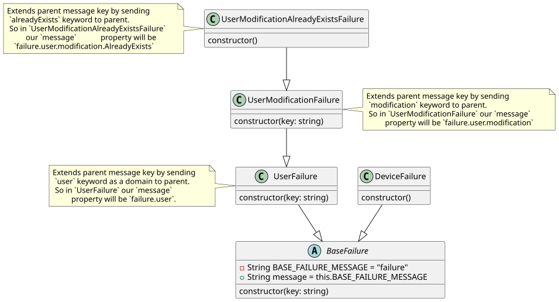

# Error handling with failure

## What is failure
In each application and in each logic, there can be failures in the process, and based on their complexity, there can be a few or many possible scenarios for these failures.

In software development, we always try to have more control over these failures to:

Avoid possible bugs
Help users understand the state of the application with proper messages
Control processes for side effects
Monitor the behavior of the application
So, having a specific way of handling errors to achieve all these requirements in our app helps us build a more robust, reliable, and maintainable application.

Many frameworks provide their own ways to handle these failures, which they may call exceptions, failures, or other terms. But we shouldn't always depend on the behavior of frameworks for our logic and apps. Besides, many frameworks do not provide error handling tools, so we need to design a reliable architecture for the error handling in our application.

## Failure handling with base failure
To have granular control over failures and define a specific type for all errors, we can use the power of inheritance and abstraction in OOP.

We can define an abstract class as our base failure, which serves as the specific type for all failures in the application.

```ts
export default abstract class BaseFailure<META_DATA> {

  metadata: META_DATA | undefined;

  constructor(metadata?: META_DATA) {
    this.metadata = metadata ?? undefined;
  }
}

```
As you can see, it's just a simple abstract class that takes some metadata about the error details in any form. But wait, this is just the beginning of the story, we can explore many ideas with this failure.

## How to write a simple failure
So, to create a simple failure, we can define our failure in any domain for any scenario we need, like this:

```ts
export default class CreateUserFailure extends BaseFailure<{ userId: string }> {
  constructor(metadata?: { userId: string }) {
    super(metadata);
  }
}
```

So in our logics for creating user we can return specific type of failure for creating user.

## Combination with Functional programming
Functional programming is a deep topic that we cannot fully cover here. For more details, you can check out various courses and books available online.

However, for this article, we focus on one of the most useful functors in functional programming and how failure fits perfectly with it. This concept is the Either type.

Either is an algebraic data type (ADT) that represents computations that can return either a success or a failure. It consists of two possible values:

- Right(value): Represents a successful result.
- Left(error): Represents a failure or unexpected result.

You're guessing right, our base failure will serve as the Left value in Either, allowing us to handle errors in a structured and functional way.

```ts
Either<
  BaseFailure<unknown>,
  ResponseType
>
```
So as we always have specific type for handling unexpected results, so we can define a new type for either in our app.
```ts
export type ApiEither<ResponseType> = Either<
  BaseFailure<unknown>,
  ResponseType
>;
```
So, for any API calls, we can use the Either type to handle both success and failure cases.

Additionally, for asynchronous processes, we use TaskEither, which works similarly to Either but is designed for handling asynchronous operations.


```ts
type ApiTask<ResponseType> = TaskEither<BaseFailure<unknown>, ResponseType>;
```

For example, when creating a customer repository to handle all API calls for customers, we can use this type to manage success and failure cases.

```ts
export default interface CustomerRepo {
  fetchList(query: string): ApiTask<Customer[]>;
}
```
And in the repo we can have this pipe to get customer data:

> Note: In functional programming, a pipe is a composition of functions where the output of one function is passed as the input to the next, allowing for a clean, readable flow of data transformations.

```ts
pipe(
      tryCatch(
        async () => {
          ...// calling api and returning result
        },
        (l) => failureOr(l, new NetworkFailure(l as Error)),
      ),
      map(this.customersDto.bind(this)),
    ) as ApiTask<Customer[]>;
```
As you can see, in the try-catch block, which is the constructor of ApiEither, we define the right response in the first callback and the failure in the second callback argument.

failureOr is just a helper function that takes an error and converts it into a specific failure type, NetworkFailure in this example.

This ensures that during the process of fetching customer data, we always know the unexpected result will be of a specific type.
```ts
export function failureOr(
  reason: unknown,
  failure: BaseFailure<any>,
): BaseFailure<any> {
  if (reason instanceof BaseFailure) {
    return reason;
  }
  return failure;
}
```
So in the process of fetching customer we know the unexpected result, always will be a speicfic type. 
So in any layer we can get the failure do some logics on left response based on its metadata and turn the failure shape to any other failure shape and use it for different purposes.

## Usecases of this idea

There are many situations where, if an important process encounters problems, we want to have control over it. We need to know when and why these issues happened and store that information in one of the monitoring tools.

For example, when a CreateUserFailure occurs in the repository layer, we can send a log with the specific time and relevant parameter data to any logging or monitoring tool.

### Monitoring on bugs with dev failures
There are many situations, especially in frontend applications, where unexpected behavior occurs due to development mistakes or bugs. For example, when bugs or data changes in APIs happen, it's possible to face unexpected behaviors. In such cases, we want to show a specific message or redirect the user to an error page with a clear message.

Additionally, in frontend applications, logs may not be directly available in these situations, as the issue occurs on the user's system. To handle this, we can send metadata as a log to an API when encountering development failures.

To achieve this, we can simply define another abstract failure like this:

```ts
export default abstract class BaseDevFailure<
  META_DATA,
> extends BaseFailure<META_DATA> {}
```
As you can see, it’s just another failure that extends from the base failure.

For example, in some parts of the application, when sending dynamic arguments into the domain layer, there's a possibility of sending unexpected data. In such situations, we can define a specific development failure like this:
```ts
export default class ArgumentsFailure<
  META_DATA,
> extends BaseDevFailure<META_DATA> {
  constructor(metadata?: META_DATA) {
    super(metadata);
  }
}
```
So we can consider this scenario in our logics and facing with this failure we can make a log request to our log api even from frontend applications, so on facing with this situation they can show a descent message to user to contact to support team at the same time they store the bug log to have full controll on these situations.

### Manage translations and error messages with failure
With this approach, we can go a step further than just error handling and even manage translations and display related messages in frontend applications automatically.

For each process and scenario, we should define a specific failure. At the same time, for each failure, we should display a corresponding message in the selected language based on the user's preference.

We can use this idea to automate both the error handling and message translation process.

To achieve this, we can pass a unique string key from the constructor based on the failure scenario. Our base failure will look like this:
```ts
export default abstract class BaseFailure<META_DATA> {
  private readonly BASE_FAILURE_MESSAGE = "failure";

  /**
   * Use this message as key lang for failure messages
   */
  message = this.BASE_FAILURE_MESSAGE;

  metadata: META_DATA | undefined;

  constructor(key: string, metadata?: META_DATA) {
    this.message = makeFailureMessage(this.message, key);
    this.metadata = metadata ?? undefined;
  }
}

/**
 * Gets Message key and it'll add it to the failure message key hierarchy
 */
export function makeFailureMessage(message: string, key: string) {
  if (!key) return message;
  return `${message}.${key}`;
}

```
As you can see, we have a message property, which contains `BASE_FAILURE_MESSAGE`, the base key for all failure messages. It also accepts a key from the constructor, and with the makeFailureMessage function, it concatenates the new key with the message, shaping a unique message for each failure.

Each failure can have its own key passed from its constructor.

In the end, we can have a chained message key that we can use as the message key for each failure.

For example, for a failure like `UserAlreadyExistsFailure`, we can have a parent failure for all user domain failures, like this:


```ts
export default class UserFailure extends BaseFailure {
  constructor(key: string) {
    super(makeFailureMessage("user", key));
  }
}
```
and now we can define our failure:
```ts
export default class UserAlreadyExistsFailure extends UserFailure {
  constructor() {
    super("alreadyExists");
  }
}
```
so the result of message for `UserAlreadyExistsFailure`, will be `failure.user.alreadyExists`.

At the same time, in another part of our project, we're using a langKey object to specify the translation key. This object, like the failure structure, follows the domain and folder structure to specify the language key.

```ts
const langKey = {
  // ...
    failure: {
      user: {
        alreadyExists: "failure.user.alreadyExists",
      }
  }
}
```
So, we can use our failure message key to retrieve the language key. By passing it to the translation method, we can get the translated failure message and automate the process of displaying the error message based on the failure we encounter.

```ts
const usecaseResponse = await getUsersUsecase() as Promise<Either<BaseFailure, User[]>>

if (!isLeft(usecaseResponse)) return;
  if (!(usecaseResponse instanceOf BaseFailure)) return;

const translatedFailureMessage = t(usecaseResponse.left.message)
```
This is the final version, class diagram for our failur architecture:


## Conclusion
In this article, we've explored how to handle failures effectively in software applications by combining error handling with functional programming concepts like the Either type. 

Furthermore, by integrating these failure handling mechanisms with automated processes for translating and displaying error messages, we create a more seamless experience for users, no matter the scenario. This approach not only improves the user experience by offering clear and context-specific messages, but it also provides valuable insights through monitoring and logging, enabling teams to quickly address issues.

Ultimately, this architecture supports building more robust, maintainable, and user-friendly applications, which I have used in many of my own projects, especially in frontend ones.

